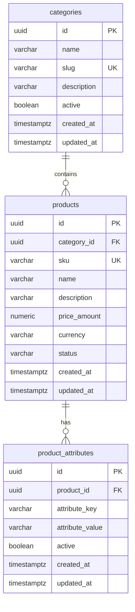
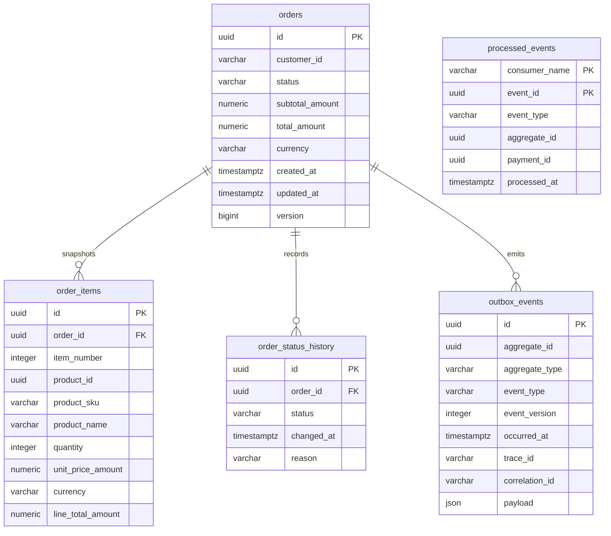
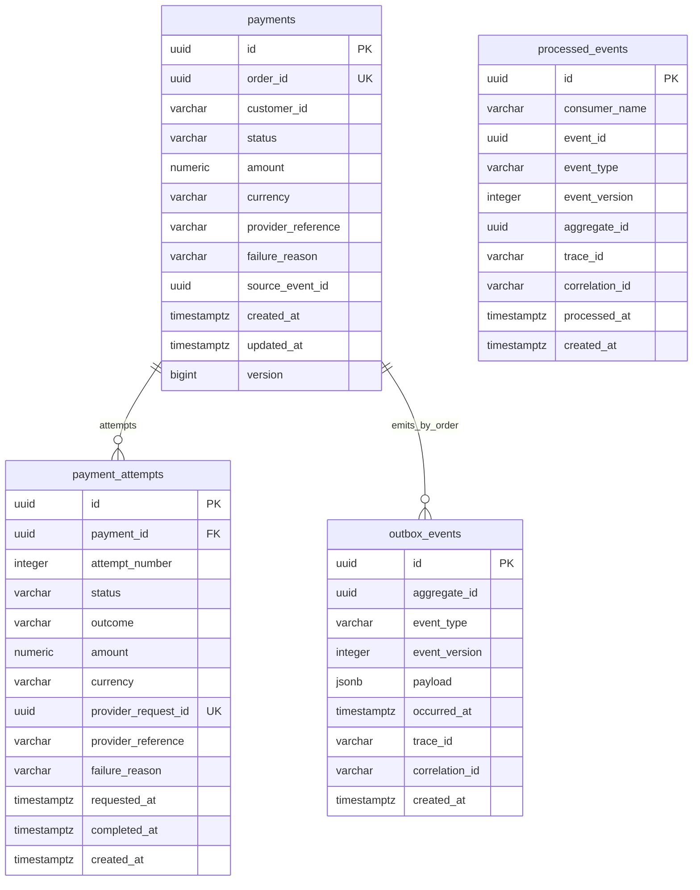

# Data Model

This document summarizes the reviewable text schema for the service-owned
stores. PostgreSQL schemas come from Flyway migrations, and MongoDB documents
come from Spring Data document classes.

Related docs:

- [Architecture](architecture.md) for ownership and event flow.
- [Demo runbook](demo-runbook.md) for runtime evidence queries.
- [Integration tests](integration-tests.md) for real PostgreSQL, Redis, Kafka
  and MongoDB validation.

## Catalog PostgreSQL

Catalog owns product/category data and Spring Batch supplier-import metadata in
the `catalog` database. Product detail reads also use Redis cache-aside keys,
but PostgreSQL remains authoritative.

Important constraints and indexes:

- `categories.slug` is unique and non-blank.
- `products.sku` is unique and non-blank.
- `products.status` is constrained to `DRAFT`, `ACTIVE` or `INACTIVE`.
- `products.price_amount` must be non-negative and `currency` must be three
  characters.
- `product_attributes` are unique per `(product_id, attribute_key)` and are
  deleted with their owning product.
- Read indexes cover category active state, product category/status and
  product attributes by product.
- Spring Batch metadata tables are stored in the same Catalog database:
  `BATCH_JOB_INSTANCE`, `BATCH_JOB_EXECUTION`,
  `BATCH_JOB_EXECUTION_PARAMS`, `BATCH_STEP_EXECUTION`,
  `BATCH_STEP_EXECUTION_CONTEXT`, `BATCH_JOB_EXECUTION_CONTEXT` and their
  sequences.

Redis keys are namespaced by the configured product-detail prefix, defaulting
to `catalog:product-detail`, with companion Redisson lock keys for cache-miss
stampede protection.

## Order PostgreSQL

Order owns customer orders, immutable product snapshots, order status history,
the `OrderCreated` outbox and idempotency markers for payment-result events in
the `orders` database.

Important constraints and indexes:

- `orders.status` is constrained to `CREATED`, `PAYMENT_PENDING`, `PAID`,
  `PAYMENT_FAILED` or `CANCELLED`.
- `orders.total_amount` must match `subtotal_amount` in V1, both amounts must
  be non-negative, currency must be uppercase three-letter text and optimistic
  `version` must remain non-negative.
- `order_items` are unique by `(order_id, item_number)` and `(order_id,
  product_id)`.
- `order_items.line_total_amount` must equal `unit_price_amount * quantity`.
- `order_status_history.status` uses the same status set as `orders.status`.
- `outbox_events.event_version` must be positive, and outbox rows are indexed
  by aggregate and event type for CDC inspection.
- `processed_events` has a composite primary key `(consumer_name, event_id)`
  and only accepts `PaymentSucceeded` or `PaymentFailed` event types.

## Payment PostgreSQL

Payment owns payment state, provider attempts, `OrderCreated` idempotency
markers and terminal payment-result outbox rows in the `payments` database.

Important constraints and indexes:

- `payments.order_id` is unique, so one order has one payment record.
- `payments.status` is constrained to `PENDING`, `SUCCEEDED` or `FAILED`.
- Payment customer IDs are non-blank strings derived from the order event.
- Payment amounts are positive and currencies match uppercase ISO-style
  three-letter text.
- `payment_attempts` are unique by `(payment_id, attempt_number)` and by
  `provider_request_id`.
- Attempt status is `PENDING`, `SUCCEEDED` or `FAILED`.
- Attempt outcome is `REQUESTED`, `SUCCEEDED`, `DECLINED`, `TIMED_OUT`,
  `PROVIDER_5XX` or `MALFORMED_RESPONSE`.
- `processed_events` has a unique `(consumer_name, event_id)` constraint for
  idempotent `OrderCreated` handling.
- `outbox_events` stores `PaymentSucceeded` or `PaymentFailed` version-1 JSONB
  envelopes for Debezium.

## Audit Notification MongoDB

Audit Notification owns two MongoDB collections in the `audit` database:
`audit_events` and `notification_deliveries`. They store flexible event
payloads and replay-safe notification state without importing Order or Payment
domain classes.

### `audit_events`

| Field | Meaning |
| --- | --- |
| `_id` | Mongo document ID. |
| `event_id` | Versioned envelope event ID, unique replay boundary. |
| `event_type` | `OrderCreated`, `PaymentSucceeded` or `PaymentFailed`. |
| `event_version` | Positive event-envelope version. |
| `aggregate_id` | Envelope aggregate ID, the order ID for V1 events. |
| `order_id` | Searchable order reference. |
| `customer_id` | Searchable customer reference. |
| `payment_id` | Searchable payment reference for payment-result events. |
| `occurred_at` | Event occurrence time from the envelope. |
| `received_at` | Audit service receive time. |
| `trace_id` | Envelope trace ID. |
| `correlation_id` | Envelope/request correlation ID. |
| `source_topic` | Kafka topic consumed. |
| `source_partition` | Kafka source partition. |
| `source_offset` | Kafka source offset. |
| `payload` | Complete structured event payload. |

Indexes:

- Unique `ux_audit_events_event_id` on `event_id`.
- Search indexes on `event_type`, `aggregate_id`, `order_id`, `customer_id`,
  `payment_id`, `occurred_at` and `correlation_id`.

### `notification_deliveries`

| Field | Meaning |
| --- | --- |
| `_id` | Mongo document ID. |
| `event_id` | Source event ID. |
| `channel` | `EMAIL` or `PUSH`. |
| `event_type` | Source event type. |
| `event_version` | Positive event-envelope version. |
| `order_id` | Order reference. |
| `customer_id` | Customer reference. |
| `payment_id` | Optional payment reference for terminal payment events. |
| `status` | `PENDING`, `IN_PROGRESS`, `SENT` or `FAILED`. |
| `attempt_count` | Non-negative delivery attempt count. |
| `last_attempt_at` | Last dispatch attempt time. |
| `safe_failure_detail` | Sanitized failure detail, capped at 512 characters. |
| `event_occurred_at` | Source event occurrence time. |
| `created_at` | Delivery ledger creation time. |
| `updated_at` | Last delivery ledger update time. |
| `trace_id` | Envelope trace ID. |
| `correlation_id` | Envelope/request correlation ID. |

Indexes:

- Unique `ux_notification_deliveries_event_channel` on `(event_id, channel)`,
  so each event has at most one delivery record per channel.
- Search indexes on `event_id`, `channel`, `event_type`, `order_id`,
  `customer_id`, `payment_id`, `status` and `correlation_id`.

Replay behavior:

- Duplicate audit events converge on the unique `event_id`.
- Missing notification channel records can be recreated on replay.
- Existing `FAILED` or `IN_PROGRESS` deliveries are returned to `PENDING`.
- Completed `SENT` delivery records are not duplicated.
